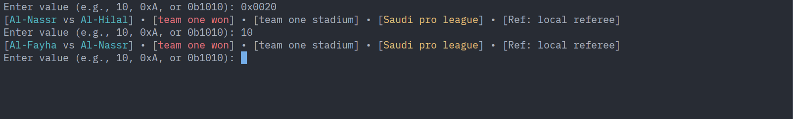

# football_teams_bitwise_project (Tuwaiq Project)

A lightweight Go-based CLI tool that decodes a single integer into full football match details. By using bitmasking, this project extracts specific data—teams, stadium, championship, match result, and referee—from a single numerical input.

## How to use it?

- Type:
```bash
    go run main.go
```

- Then you can follow the demo on how it works:

